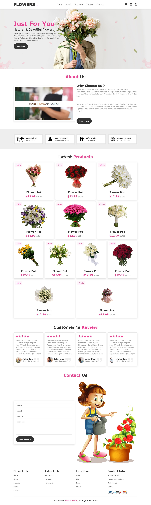

# 🌸 Flower Store | Frontend Project

  <!-- ضع صورة المعاينة هنا -->

## 👋 Hello! I’m Basma
I’m a **Junior Frontend Developer & Web Designer** passionate about creating beautiful **responsive web experiences**.  
I specialize in **HTML, CSS, JavaScript, and interactive store layouts**.

## 🔗 Live Demo
Check out the live version of the store:  

[🌐 View Flower Store](https://basmareda13.github.io/Flower/)

## 🛠 Built With
 
 
 

## 💼 Features
- Elegant and modern UI design for a flower shop  
- Fully responsive layout (desktop, tablet, mobile)  
- Product display sections ready for dynamic content  
- Smooth user interactions (hover effects, buttons, modals)  
- Clean and commented code for easy maintenance  

## 🎯 Purpose
This project is a **frontend practice store** to:  
- Improve skills in HTML, CSS, JavaScript  
- Build interactive product layouts  
- Create a portfolio-ready store design  
- Showcase web development and UI design skills  

## 📞 Contact
Direct email and phone contact details for clients and collaborators  

## 📬 Connect With Me
  
  

✨ *This project is a work in progress — more features and interactivity will be added soon!*
